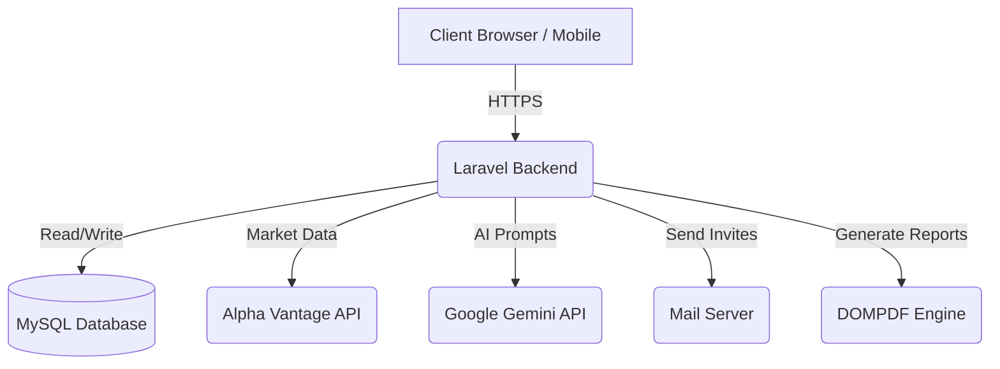

<div align="center">

# 🚀 FinanceAI Advisor (Enterprise Edition)
**An AI-driven, multi-tenant financial management SaaS platform.**

[](https://laravel.com)
[](https://php.net)
[](https://tailwindcss.com)
[](https://mysql.com)
[](https://deepmind.google/technologies/gemini/)

[Live Demo](https://ai-finance-advisor-ebon.vercel.app) • [Report Issue](#-contact--hire-me) • [Request Feature](#-contact--hire-me)

*Developed by **Het Soni** — Full Stack Web Developer.*

</div>

---

## 🎯 Project Overview

**FinanceAI Advisor** is not just another budgeting app; it is a comprehensive, AI-powered financial SaaS designed for individuals and families. It bridges the gap between manual ledger tracking and intelligent financial forecasting.

This project was built to demonstrate **enterprise-level architecture**, focusing on scalability, secure multi-tenancy, and seamless third-party API integration.

### 💡 The Problem It Solves
Managing shared finances across family members is often chaotic, and getting personalized financial advice requires expensive human consultants. FinanceAI solves this by providing a unified, secure ledger with role-based access, topped with a contextual AI agent that analyzes your specific spending habits and market conditions.

---

## 🔥 Enterprise Features & Technical Highlights

### 1. 🧠 Context-Aware AI Engine
- **Integration:** Utilizes the **Google Gemini API** for natural language financial advice and **Alpha Vantage API** for real-time stock market data.
- **Contextual Awareness:** The AI doesn't just give generic advice; it reads the authenticated user's specific financial goals, income metrics, and expense history to provide tailored guidance.

### 2. 🔐 Multi-Tenant Family Workspaces (RBAC)
- **Data Isolation:** Implemented strict query scoping to ensure personal expenses are kept private, while family expenses are visible only to invited members.
- **Magic Link Invitations:** Built a secure, tokenized email invitation system allowing users to onboard family members with a single click.
- **Role-Based Access Control:** Granular permissions preventing standard members from modifying administrative family settings.

### 3. 📊 Advanced Data Analytics & Reporting
- **Dynamic Charting:** Integrated `QuickChart` to render complex financial visualizations on the fly without heavy frontend JavaScript libraries.
- **Automated PDF Generation:** Utilized `DOMPDF` to stream heavily formatted, downloadable monthly financial statements directly to the user.

### 4. 🛡️ Security & Auditing
- **Activity Logging:** Integrated `spatie/laravel-activitylog` to maintain an immutable audit trail of all sensitive user actions (login, expense modification, family invitations).
- **Sanctum Authentication:** Hardened API and session security using Laravel Sanctum.

---

## 🏗️ System Architecture



---

## 💻 Tech Stack Deep Dive

- **Core Framework:** Laravel 8 (PHP 7.3/8.0)
- **Database Architecture:** MySQL (Managed via Doctrine DBAL & Eloquent ORM)
- **Frontend Design System:** Tailwind CSS 3.4
- **Asset Compilation:** Laravel Mix / Webpack
- **Asynchronous Requests:** Axios
- **Deployment:** Vercel (Frontend/Serverless) & Custom VPS

---

## 🚀 Local Development Setup

If you wish to run this project locally to review the codebase or contribute:

1. **Clone the repository:**
   ```bash
   git clone https://github.com/HetSoni28/ai-finance-advisor.git
   cd ai-finance-advisor
   ```

2. **Install Dependencies:**
   ```bash
   composer install
   npm install
   ```

3. **Configure Environment:**
   ```bash
   cp .env.example .env
   php artisan key:generate
   ```
   *Note: Ensure you provision a MySQL database and populate the `DB_*`, `GEMINI_API_KEY`, and `ALPHA_VANTAGE_API_KEY` variables.*

4. **Migrate & Serve:**
   ```bash
   php artisan migrate
   npm run dev
   php artisan serve
   ```

---

## 📸 Platform Interface

*(Replace these placeholders with high-quality screenshots of your work to impress clients)*

| **Dashboard Analytics** | **AI Financial Assistant** |
| :---: | :---: |
|  |  |

| **Family Collaborative Workspace** | **Automated Reporting** |
| :---: | :---: |
|  |  |

---

## 🤝 Contact & Hire Me

**Are you looking for a Full-Stack Developer to build scalable, secure, and AI-integrated web applications?** 

I am currently open to freelance opportunities and full-time roles. I specialize in PHP, Laravel, React/Vue, and AI integrations.

📫 **Email:** hetsony143@gmail.com  
💼 **GitHub:** [github.com/HetSoni28](https://github.com/HetSoni28)

*If you like this project, please consider giving it a ⭐!*
